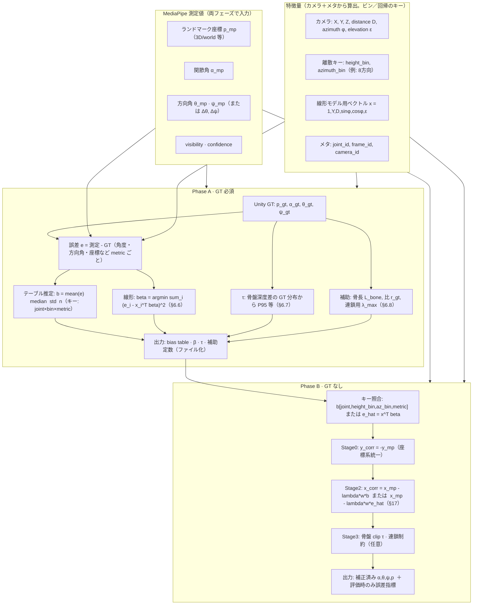
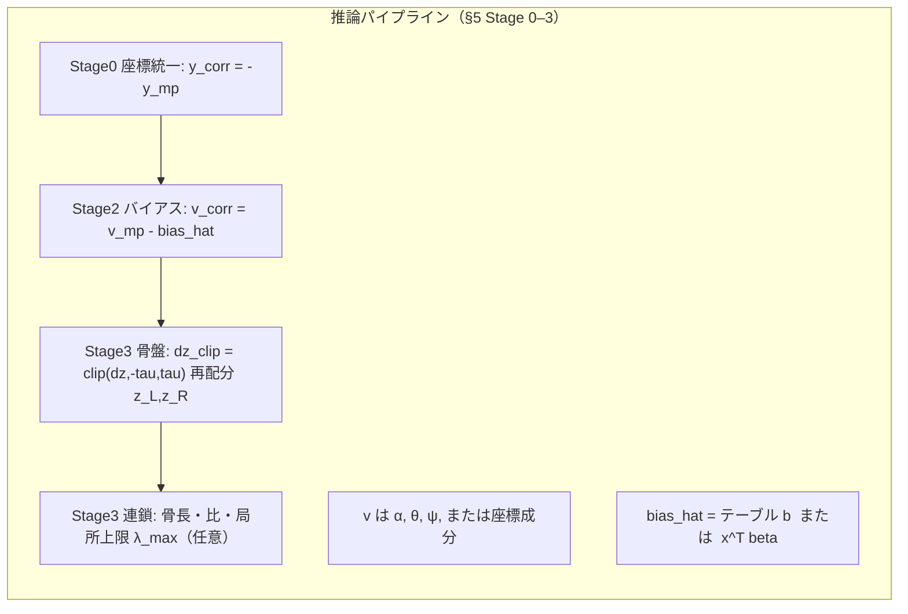

# MediaPipe Pose 補正アーキテクチャ図（Mermaid）

仕様書 `01_MediaPipe Pose 補正モデル・アーキテクチャ仕様.md` の §4.10 に対応する図のソース。Obsidian / VS Code（Mermaid 拡張）でプレビュー可能。

## 画像出力（生成済みファイル）

同フォルダにレンダリング済み画像を置いている。

| 内容 | PNG | SVG |
| --- | --- | --- |
| 図1 Phase A/B データ流れ | `03-fig1-phase-ab.png` | `03-fig1-phase-ab.svg` |
| 図2 推論 Stage 0–3 | `03-fig2-inference-stages.png` | `03-fig2-inference-stages.svg` |

## 図1: Phase A（キャリブレーション）と Phase B（推論）のデータ流れ

## 図2: 処理ステージと主要な式（推論側）

